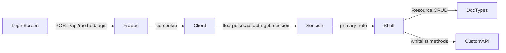

# FloorPulse — Developer Notes

Implementation details, local setup, and API reference for contributors.

---

## Repository Layout

```
floorpulse/
├── app/                    # Flutter mobile app (iOS + Android)
├── backend/
│   └── floorpulse/         # ERPNext custom app (Python / Frappe)
│       ├── setup.py
│       └── floorpulse/
│           ├── hooks.py
│           ├── setup/install.py    # after_install / after_migrate hooks
│           ├── data/seed_data.py   # Demo data seeder
│           ├── api/                # Custom whitelist methods
│           └── floorpulse/         # Main Frappe module
│               ├── workspace/      # FloorPulse workspace definition
│               ├── report/         # Pareto Analysis, Downtime Log
│               └── doctype/        # Custom DocTypes
│                   ├── customer_visit/
│                   ├── warehouse_task/
│                   ├── ncr/
│                   ├── loto/
│                   ├── gate_entry/
│                   ├── sales_memo/
│                   ├── promise_to_pay/
│                   ├── vendor_scorecard/
│                   ├── calibration/
│                   ├── quality_hold/
│                   ├── material_return/
│                   ├── subcontract_challan/
│                   ├── customer_complaint/
│                   └── floorpulse_notification/
├── Dockerfile
├── docker-compose.yml
├── Makefile
└── .env.example
```

---

## Custom DocTypes

FloorPulse adds only what ERPNext does not already provide. Inspections, repairs, work orders, and stock movements use built-in DocTypes.

| DocType | Module | Purpose |
|---|---|---|
| **Customer Visit** | FloorPulse | Sales site check-in/out, purpose, GPS, outcome |
| **Warehouse Task** | FloorPulse | Mixed mobile queue (GRN / put-away / pick / cycle count / transfer / returns). Execution is on the linked stock document. |
| **NCR** | FloorPulse | Manufacturing non-conformance (item, qty rejected, disposition) plus CAPA fields. Not ERPNext ISO **Non Conformance**. |
| **LOTO** | FloorPulse | Lockout/tagout register linked to Asset / Asset Repair / Maintenance Visit |
| **Gate Entry** | FloorPulse | Vehicle / party in-gate log (purpose, driver, status) |
| **Sales Memo** | FloorPulse | Voice or note memo linked to Customer / product interest |
| **Promise to Pay** | FloorPulse | Standalone PTP linked to Customer and optional Sales Invoice |
| **Vendor Scorecard** | FloorPulse | Lightweight supplier quality/delivery rating. Not ERPNext **Supplier Scorecard**. |
| **Calibration** | FloorPulse | Instrument / Asset calibration due date, result, next due |
| **Quality Hold** | FloorPulse | Hold / release of item (optional batch) with timestamps |
| **Material Return** | FloorPulse | Return request (customer / store / supplier). Warehouse execution stays on Warehouse Task `Returns Processing`. |
| **Subcontract Challan** | FloorPulse | Shop-floor send/receive vs a supplier. Not ERPNext **Subcontracting Order**. |
| **Customer Complaint** | FloorPulse | Customer complaint and resolution |
| **FloorPulse Notification** | FloorPulse | In-app alert for a user / shell. Not Frappe **Notification**. |

### Reuse ERPNext / Frappe instead of custom types

| Mobile feature | DocType |
|---|---|
| Incoming / in-process / outgoing inspection, readings, verdict | **Quality Inspection** |
| Breakdown job, consumed spares, downtime | **Asset Repair** |
| Customer-site field service | **Maintenance Visit** |
| Scheduled PM log | **Asset Maintenance Log** |
| Shop-floor jobs | **Work Order**, **Job Card** |
| GRN / pick / transfer / cycle count | **Purchase Receipt**, **Pick List**, **Stock Entry**, **Stock Reconciliation** |
| Packing cartons / weight | **Delivery Note** fields `fp_carton_count`, `fp_gross_weight`, `fp_cartons_sealed`, `fp_labels_affixed` |
| New quote / lead | **Quotation**, **Lead** |
| Photos, signatures, evidence | **File** attachments |
| Approvals | **Workflow** on Sales Order |
| Customer credit / payment terms | Customer **credit_limits** / **payment_terms** |
| Defect Pareto | Query Report **Pareto Analysis** (`ref_doctype` NCR) |
| Machine downtime | Query Report **Downtime Log** (`ref_doctype` Asset Repair) |

Custom fields on Asset, Maintenance Visit, Asset Repair, Asset Maintenance Log, Sales Order (`fp_visit_reference`), Purchase Receipt (`fp_grn_task_reference`), Delivery Note (packing), and Customer (`fp_segment`) carry FloorPulse-specific data on those built-ins. Asset also has `fp_meter_readings` (JSON) for named meters until a child table exists.

---

## Local Setup

### Prerequisites

- Docker Desktop v4.x or later
- `make`
- Port 8080 available on localhost

### First-time setup

```bash
# 1. Copy and edit environment file
cp .env.example .env
# Edit .env — change DB_PASSWORD and ADMIN_PASSWORD at minimum

# 2. Add site to /etc/hosts
echo "127.0.0.1  floorpulse.localhost" | sudo tee -a /etc/hosts

# 3. Build image, start services, create site, and seed demo data
make install
```

The ERPNext web UI will be available at `http://floorpulse.localhost:8080`.  
Login: `Administrator` / the `ADMIN_PASSWORD` you set in `.env`.

---

## Daily Commands

| Command | What it does |
|---|---|
| `make start` | Start all services |
| `make stop` | Stop all services |
| `make restart` | Restart all services |
| `make logs` | Tail logs from all containers |
| `make shell` | Open a bash shell in the backend container |
| `make bench CMD="list-apps"` | Run any `bench` command |
| `make migrate` | Apply schema changes and patches |
| `make seed` | Re-seed demo data (idempotent). Creates company **FloorPulse Demo** via the ERPNext setup wizard if the site has none. |
| `make test` | Run unit tests |

---

## Danger Zone

```bash
make reset-site   # Drop & recreate the ERPNext site (data loss)
make nuke         # Remove all containers and Docker volumes (full reset)
```

Both commands prompt for confirmation before executing.

---

## REST API

Same principle as custom DocTypes: FloorPulse adds only what Frappe/ERPNext does not already provide. The Flutter app is mock-only. Connecting it should default to `/api/resource/<DocType>` plus existing Frappe/ERPNext methods — not a parallel API layer. Custom whitelist methods live in `floorpulse/api/` and cover only aggregations or atomic multi-doc posting.

Primary client: shop-floor mobile / PWA.

Demo users (after `make seed`):

| Username | Password | Shell |
|---|---|---|
| `production` | `prod123` | production |
| `qc` | `qc123` | qc |
| `warehouse` | `wh123` | warehouse |
| `sales` | `sales123` | sales |
| `maintenance` | `maint123` | maintenance |

Login with the username or the email `username@floorpulse.local`.

```bash
# Authenticate
POST /api/method/login
{"usr": "user@example.com", "pwd": "password"}

# List Customer Visits
GET /api/resource/Customer Visit?filters=[["status","=","Completed"]]

# Create a new Customer Visit
POST /api/resource/Customer Visit
Content-Type: application/json
{"customer": "Acme Corp", "sales_person": "...", "visit_date": "2024-06-01", ...}

# Quality Inspection (ERPNext)
GET /api/resource/Quality Inspection

# Asset Repair (ERPNext)
GET /api/resource/Asset Repair
```

The same Resource pattern applies to `Warehouse Task`, `NCR`, `LOTO`, `Gate Entry`, `Sales Memo`, `Promise to Pay`, `Vendor Scorecard`, `Calibration`, `Quality Hold`, `Material Return`, `Subcontract Challan`, `Customer Complaint`, `FloorPulse Notification`, `Work Order`, `Pick List`, and other DocTypes — substitute the name in the URL.

Mobile auth: cookie jar on `login`, or `Authorization: token api_key:api_secret`. No custom auth server.

### Reuse — Frappe Resource API

Standard verbs on every DocType (auth required):

- `GET /api/resource/{DocType}` — list (`filters`, `fields`, `limit_start`, `limit_page_length`, `order_by`)
- `GET /api/resource/{DocType}/{name}` — get (includes child tables)
- `POST` create / `PUT` update / `DELETE`
- Submit/cancel via Frappe client methods (below), not a custom endpoint

#### Custom FloorPulse DocTypes

| Mobile action | Resource call |
|---|---|
| Schedule visit | `POST /api/resource/Customer Visit` |
| Check-in / GPS / check-out / outcome | `PUT` Customer Visit (`status`, `check_in_time`, `check_out_time`, `location_*`, `outcome`, `notes`) then `frappe.client.submit` |
| Warehouse queue list | `GET` Warehouse Task `filters=[["assigned_to","=",user]]` |
| Raise NCR / CAPA / close NCR | `POST`/`PUT` NCR (CAPA is fields on NCR, not a separate DocType) |
| LOTO register, apply, remove | `GET`/`PUT` LOTO (`status` auto-stamps `applied_on` / `removed_on` in the LOTO controller) |
| Gate in/out | `POST`/`PUT` Gate Entry |
| Sales memo | `POST`/`PUT` Sales Memo |
| Record PTP | `POST` Promise to Pay (`customer`, `promise_amount`, `expected_date`, optional `sales_invoice`) |
| Packing cartons / weight | `PUT` Delivery Note (`fp_carton_count`, `fp_gross_weight`, `fp_cartons_sealed`, `fp_labels_affixed`) |
| Vendor scorecard | `POST`/`PUT` Vendor Scorecard |
| Calibration | `POST`/`PUT` Calibration |
| Hold / release | `PUT` Quality Hold (`status` stamps `held_on` / `released_on`) |
| Material return request | `POST`/`PUT` Material Return |
| Subcontract send/receive | `POST`/`PUT` Subcontract Challan |
| Customer complaint | `POST`/`PUT` Customer Complaint |
| In-app notification | `GET` FloorPulse Notification `filters=[["for_user","=",user]]` |

#### ERPNext DocTypes the app already maps to

| Role | List / detail via Resource |
|---|---|
| Production | Work Order, Job Card |
| QC | Quality Inspection (readings child table), Batch |
| Warehouse | Purchase Order, Purchase Receipt, Pick List, Stock Entry, Stock Reconciliation, Material Request, Delivery Note, Item, Bin, Warehouse, Stock Ledger Entry |
| Sales | Customer, Sales Order, Sales Invoice, Quotation, Lead, Payment Entry, Delivery Note |
| Maintenance | Asset, Asset Repair, Maintenance Visit, Asset Maintenance Log, Material Request |

Child tables (QI readings, SO items, PR items, Asset Repair consumed items, Job Card time logs) travel with the parent GET/PUT. Do not invent per-child APIs.

File / photo / signature: `POST /api/method/upload_file` then set the Attach field (`visit_photo`, `fp_customer_signature`). Print: Frappe print-format download (`download_pdf`).

### Reuse — Frappe core methods

| Need | Method |
|---|---|
| Login / logout | `POST /api/method/login`, `logout` |
| Who am I | `frappe.auth.get_logged_user` |
| Counts for simple KPIs | `frappe.client.get_count` |
| Submit / cancel | `frappe.client.submit` / `cancel` |
| Link search | `frappe.desk.search.search_link` |
| Workflow approve/reject (Sales Order) | `frappe.model.workflow.apply_workflow` |
| Assignment | `frappe.desk.form.assign_to.add` |
| Comments | `frappe.desk.form.utils.add_comment` |
| Reports (Pareto, Stock Ledger, downtime) | `frappe.desk.query_report.run` — **Pareto Analysis**, **Downtime Log**, **Stock Ledger** |
| PDF | `frappe.utils.print_format.download_pdf` |

### Reuse — ERPNext whitelist methods

Do not reimplement stock/manufacturing posting in FloorPulse. Call these from Flutter or from the thin wrappers below.

| Flow | Existing method (ERPNext v15) |
|---|---|
| GRN from PO | `erpnext.buying.doctype.purchase_order.purchase_order.make_purchase_receipt` then Resource PUT lines (qty/batch) then `frappe.client.submit` |
| Material issue / put-away / transfer | Resource POST **Stock Entry** (`Material Issue` / `Material Transfer`) then submit |
| Pick → Delivery Note | `erpnext.stock.doctype.pick_list.pick_list.create_delivery_note` / `create_stock_entry` |
| Job start / complete | Job Card time logs on the document; `erpnext.manufacturing.doctype.work_order.work_order.make_stock_entry` for finish/consume |
| Payment against invoice/SO | `erpnext.accounts.doctype.payment_entry.payment_entry.get_payment_entry` then insert + submit |
| Item/batch/serial barcode | `erpnext.stock.utils.scan_barcode` (Item / Batch / Serial only) |
| Stock balance | Query Report **Stock Ledger** / **Stock Balance** |
| Consume spares | Asset Repair `consumed_items` via Resource, or Material Request if qty = 0 |

**E-way bill:** the image is `frappe/erpnext:version-15` only — no `india_compliance`. GSTN generate/print is out of scope until that app is added. The Flutter e-way screen stays mock.

### Build — FloorPulse whitelist only

Build a method only when Resource/ERPNext cannot do it in one safe round-trip: aggregations, multi-DocType scan, or atomic multi-doc posting the Flutter client should not orchestrate.

Package: `floorpulse/api/`. All methods require a logged-in session (`POST /api/method/login` or token header). Call as `POST /api/method/<dotted.path>`.

| Method | Why custom | What it wraps |
|---|---|---|
| `floorpulse.api.auth.get_session` | Login does not return Employee, FloorPulse role, default Warehouse, Sales Person | User + Employee + roles → which home shell to open |
| `floorpulse.api.dashboard.get` | KPIs are not DocType GETs (pass %, MTTR, collection vs target, efficiency) | `get_count` + small aggregates; one payload per role |
| `floorpulse.api.scan.resolve` | One code may be Item, Batch, Serial, Asset, Job Card, PO, Bin, Warehouse Task | Tries `scan_barcode` first, then Asset / Job Card / PO / Bin |
| `floorpulse.api.warehouse.execute_task` | Warehouse Task is a queue; execution must post PR / Stock Entry / Pick List / Stock Reconciliation and complete the task atomically | ERPNext make_* + submit + Warehouse Task submit |
| `floorpulse.api.qc.submit_inspection` | Reject must write QI verdict **and** create NCR together; Final Pass “release” is QI Accepted | QI PUT + submit; optional `POST` NCR |
| `floorpulse.api.production.start_job` / `complete_job` | Raw Job Card time-log child tables are easy to get wrong on mobile | Job Card time log start/end + qty |
| `floorpulse.api.maintenance.close_job` | Close = Asset Repair submit + signature File + LOTO Removed in one action | Asset Repair + `upload_file` field + LOTO |
| `floorpulse.api.maintenance.save_meter_readings` | `fp_meter_reading` is a single float; Flutter has named meters (Hours, Cycles) | Named meters persist on Asset `fp_meter_readings` (JSON); Hours (or first value) also written to `fp_meter_reading` |

#### Request / response shapes

**`floorpulse.api.auth.get_session`** — no args.

```json
{
  "user": "qc@floorpulse.local",
  "full_name": "Priya Sharma",
  "employee": {"name": "HR-EMP-00001", "employee_name": "Priya Sharma", "department": null},
  "primary_role": "qc",
  "roles": ["qc"],
  "default_warehouse": null,
  "sales_person": null
}
```

Role map (first match is `primary_role`): Quality Manager → `qc`; Stock User/Manager → `warehouse`; Sales User/Manager → `sales`; Maintenance User/Manager → `maintenance`; Manufacturing User/Manager → `production`.

**`floorpulse.api.dashboard.get`** — optional `role` (`production` \| `qc` \| `warehouse` \| `sales` \| `maintenance`). Defaults to `primary_role`. System Manager may request any role.

```json
{"role": "qc", "inspectionsToday": 14, "ncrsRaised": 3, "passRatePct": 91, "pendingQueue": 7, "rejectionPct": 9, "overdueCapas": 2}
```

Production keys: `activeWorkOrders`, `completedToday`, `productionEfficiency`, `openAlerts`, `pendingInspections`, `onTimeDelivery`.  
Warehouse keys: `pendingGRNs`, `pendingPutAways`, `issueRequests`, `pickLists`, `countsDue`, `stockAlerts`.  
Sales keys: `todayVisits`, `pendingApprovals`, `openOrders`, `collectionMTD`, `targetMTD`.  
Maintenance keys: `machinesDown`, `overduePM`, `mttr`, `sparesLow`.

**`floorpulse.api.scan.resolve`** — `code`.

```json
{"type": "Item", "doctype": "Item", "name": "RM-SS316-25", "label": "SS316 Round Bar", "extra": {}}
```

Throws if nothing matches. Order: `scan_barcode` (Serial / Batch / Item), Asset `fp_asset_tag` then name, Job Card, Work Order, Purchase Order, Bin, Warehouse Task.

**`floorpulse.api.warehouse.execute_task`** — `task` (Warehouse Task name), `lines` list of `{item_code, qty, batch_no?, serial_no?, from_bin?, to_bin?}`.

```json
{"task": "FP-WT-2026-00001", "status": "Completed", "posted_doctype": "Purchase Receipt", "posted_name": "PR-00001"}
```

Rolls back if posting or task submit fails. GRN / Picking / Returns Processing require `reference_document`.

**`floorpulse.api.qc.submit_inspection`** — `quality_inspection`, `status` (`Accepted` \| `Rejected`), `ncr` object required on reject (`defect_type` required; `item_code`, `quantity_rejected`, `severity`, `disposition`, `notes`, CAPA fields optional).

```json
{"quality_inspection": "QI-00001", "status": "Rejected", "ncr": "FP-NCR-2026-00001"}
```

Put QI readings via Resource before this call. Accepted inspections do not create an NCR.

**`floorpulse.api.production.start_job`** — `job_card`.

```json
{"job_card": "JC-00001", "status": "Work In Progress", "from_time": "2026-08-15 12:00:00"}
```

**`floorpulse.api.production.complete_job`** — `job_card`, optional `completed_qty`. Closes the open time log. Does not call `work_order.make_stock_entry`.

```json
{"job_card": "JC-00001", "status": "Work In Progress", "to_time": "2026-08-15 13:30:00", "completed_qty": 10}
```

**`floorpulse.api.maintenance.close_job`** — `asset_repair`, optional `signature` (File URL from `upload_file`), optional `checklist_completed`. Submits Asset Repair and sets applied LOTO rows for that asset to Removed.

```json
{"asset_repair": "AR-00001", "status": "Completed", "loto_removed": ["FP-LOTO-2026-00001"]}
```

**`floorpulse.api.maintenance.save_meter_readings`** — `asset`, `readings` e.g. `{"Hours": 1234, "Cycles": 56}`.

```json
{"asset": "AST-00001", "fp_meter_reading": 1234, "readings": {"Hours": 1234, "Cycles": 56}}
```

**Intentionally not custom** (looks like an API, but Resource is enough):

- Check-in / check-out / GPS
- NCR + CAPA CRUD
- LOTO apply/remove (except as part of `close_job`)
- Start inspection (QI status)
- Customer / SO / Quotation / Lead lists
- Asset / job lists
- Workflow approve (use `apply_workflow`)
- Logout, file upload, print PDF

### DocType gaps (API after data model)

Resource CRUD is live for the former gaps. Do not add custom whitelist methods until the Flutter UI is in scope.

| Flutter screen | Data model | Client call |
|---|---|---|
| Gate Entry | **Gate Entry** | Resource CRUD |
| Sales Memo | **Sales Memo** | Resource CRUD |
| Promise to Pay | **Promise to Pay** | Resource CRUD |
| Packing cartons/weight | Delivery Note `fp_*` packing fields | Resource PUT Delivery Note |
| Vendor visit schedule | Reuse **Maintenance Visit** | Resource |
| Supplier scorecard | **Vendor Scorecard** | Resource CRUD |
| Calibration | **Calibration** | Resource CRUD |
| Hold / release | **Quality Hold** | Resource CRUD |
| Returns | **Material Return** + Warehouse Task `Returns Processing` | Resource CRUD |
| Subcontracting | **Subcontract Challan** | Resource CRUD |
| New quote / lead | Reuse **Quotation** / **Lead** | Resource CRUD |
| Complaints | **Customer Complaint** | Resource CRUD |
| Notifications | **FloorPulse Notification** | Resource GET/PUT |
| Pareto | Query Report **Pareto Analysis** | `frappe.desk.query_report.run` |
| Downtime | Query Report **Downtime Log** | `frappe.desk.query_report.run` |

Coming-soon Flutter screens still get **no custom whitelist API**. Use Resource / query reports.

Offline sync (README claim): **defer**. No batch-sync endpoint until Resource CRUD is live online.

### Role map

| Role | Reuse | Build |
|---|---|---|
| Auth | `login` / `logout` / `upload_file` | `get_session` |
| Production | Resource WO / Job Card | `get_session`, dashboard, `scan.resolve`, `start_job` / `complete_job` |
| QC | Resource QI + NCR + Vendor Scorecard + Quality Hold + Calibration; Query Report for Pareto / ledger | dashboard, `scan.resolve`, `submit_inspection` |
| Warehouse | Resource PO / Task / Bin / Item / Gate Entry / Material Return / Subcontract Challan; ERPNext make_purchase_receipt / pick_list / Stock Entry | dashboard, `scan.resolve`, `execute_task` |
| Sales | Resource Customer / Visit / SO / SI / Quotation / Lead / Sales Memo / Promise to Pay / Customer Complaint; `apply_workflow`; `get_payment_entry` | dashboard |
| Maintenance | Resource Asset / Asset Repair / LOTO / Maintenance Visit / Calibration; Query Report Downtime Log | dashboard, `scan.resolve`, `close_job`, `save_meter_readings` |

---

## Flutter API Integration Plan

The Flutter app in `app/` is mock-only. Login hardcodes demo usernames in `app/lib/screens/auth/login_screen.dart`. Screens import `*_mock_data.dart` directly. There is no HTTP client, no session, and no `INTERNET` permission in `app/android/app/src/main/AndroidManifest.xml`.

Connect the app to the APIs above. Do not add a parallel API layer. Default to `/api/resource/<DocType>` and existing Frappe/ERPNext methods. Call FloorPulse whitelist methods only for the eight wrappers already documented.

### Current state → target



Keep mock data behind `--dart-define=USE_MOCK=true` during the cutover. Drop the mock import for a shell once that phase is live.

### Client foundation

Suggested packages: `dio` + `cookie_jar` + `dio_cookie_manager` (Frappe `sid` cookie) and `provider` for session. Do not introduce Riverpod or Bloc unless a later need appears.

Base URL: `--dart-define=FRAPPE_URL=http://floorpulse.localhost:8080` on the simulator. Use the machine LAN IP for a physical device.

Platform:

- Android: `INTERNET` permission and cleartext HTTP for localhost.
- iOS: ATS exception for local HTTP.

Error mapping: `frappe.throw` / `_server_messages` → snackbar. Screens keep UI; they stop importing `*_mock_data.dart` once that shell's phase is done.

Suggested layout (not created yet):

```
app/lib/api/frappe_client.dart      # Dio + cookie jar, login/logout, method POST
app/lib/api/session.dart            # get_session → AppUser / primary_role
app/lib/api/resource.dart           # GET/POST/PUT /api/resource/<DocType>
app/lib/api/floorpulse_api.dart     # dashboard, scan, execute_task, start_job, …
```

### Phased screen-to-API map

#### Phase 0 — Foundation (no UI change)

`FrappeClient`, cookie jar, `fromJson` on models, error mapping. No screen wiring yet.

#### Phase 1 — Auth

| Screen | Call | Replaces |
|---|---|---|
| `screens/auth/login_screen.dart` | `POST /api/method/login` then `floorpulse.api.auth.get_session` | Hardcoded username/password switch |
| More screens (all five shells) | `POST /api/method/logout` | Local `Navigator` pop to login |

Route `primary_role` to the existing homes: `production` → `HomeScreen`, `qc` → `QCHomeScreen`, `warehouse` → `WarehouseHomeScreen`, `sales` → `SalesHomeScreen`, `maintenance` → `MaintenanceHomeScreen`. Demo users already match seed (`production` / `qc` / `warehouse` / `sales` / `maintenance`).

#### Phase 2 — Dashboards

KPI keys on the five dashboards already match `floorpulse.api.dashboard.get`. One call per shell (`role` optional; defaults to `primary_role`).

| Screen | Keys already used |
|---|---|
| `screens/dashboard/dashboard_screen.dart` | `activeWorkOrders`, `completedToday`, `productionEfficiency`, `openAlerts`, `pendingInspections`, `onTimeDelivery` |
| `screens/qc/qc_dashboard_screen.dart` | `inspectionsToday`, `ncrsRaised`, `passRatePct`, `pendingQueue`, `rejectionPct`, `overdueCapas` |
| `screens/warehouse/home/warehouse_dashboard_screen.dart` | `pendingGRNs`, `pendingPutAways`, `issueRequests`, `pickLists`, `countsDue`, `stockAlerts` |
| `screens/sales/dashboard/sales_dashboard_screen.dart` | `todayVisits`, `pendingApprovals`, `openOrders`, `collectionMTD`, `targetMTD` |
| `screens/maintenance/dashboard/maintenance_dashboard_screen.dart` | `machinesDown`, `overduePM`, `mttr`, `sparesLow` |

Drop `MockData.dashboardStats`, `QCMockData.qcDashboardStats`, and the other `dashboardStats` maps.

#### Phase 3 — Scan

All scan screens call `floorpulse.api.scan.resolve` with the scanned `code`, then navigate by `doctype`:

| `doctype` | Open |
|---|---|
| Job Card | job detail |
| Work Order | work order detail |
| Asset | asset detail |
| Purchase Order | GRN / PO detail |
| Bin | bin contents |
| Warehouse Task | matching task flow |
| Item / Batch / Serial No | stock / traceability |

Screens: `screens/scan/scan_screen.dart`, `screens/qc/scan/qc_scan_screen.dart`, `screens/warehouse/scan/warehouse_scan_screen.dart`, `screens/maintenance/scan/maintenance_scan_screen.dart`.

#### Phase 4 — Production

| Screen | Call |
|---|---|
| `screens/work_orders/work_orders_screen.dart` | Resource `Work Order` list |
| `screens/work_orders/work_order_detail_screen.dart` | Resource `Work Order/{name}` |
| `screens/my_jobs/my_jobs_screen.dart` | Resource `Job Card` filtered by session Employee |
| `screens/my_jobs/job_detail_screen.dart` Start / Complete | `floorpulse.api.production.start_job` / `complete_job` (today these only mutate local `JobStatus`) |
| Job notes | `frappe.desk.form.utils.add_comment` |

Replaces `data/mock_data.dart`.

#### Phase 5 — QC

| Screen | Call |
|---|---|
| Queue / inspection detail / readings | Resource `Quality Inspection` (PUT readings child table **before** verdict) |
| `screens/qc/queue/verdict_screen.dart` Pass / Conditional Accept | `floorpulse.api.qc.submit_inspection` with `status=Accepted` |
| `screens/qc/queue/create_ncr_screen.dart` Reject | `submit_inspection` with `status=Rejected` and `ncr` (`defect_type` required) |
| NCR list / detail / CAPA | Resource `NCR` (CAPA is fields on NCR, not a separate DocType) |
| Evidence photos | `POST /api/method/upload_file` |
| Pareto | `frappe.desk.query_report.run` **Pareto Analysis** |
| Stock ledger | `frappe.desk.query_report.run` **Stock Ledger** |

Replaces `data/qc_mock_data.dart`.

#### Phase 6 — Warehouse

| Screen | Call |
|---|---|
| `screens/warehouse/tasks/tasks_screen.dart` | Resource `Warehouse Task` `filters=[["assigned_to","=",user]]` |
| GRN / put-away / issue / pick / cycle count / transfer submit | `floorpulse.api.warehouse.execute_task` with `task` + `lines: [{item_code, qty, batch_no?, serial_no?, from_bin?, to_bin?}]` |
| PO / bin / item / stock lists | Resource `Purchase Order`, `Bin`, `Item`, `Warehouse` |
| Gate Entry | Resource `Gate Entry` |

`execute_task` posts PR / Stock Entry / Pick List / Stock Reconciliation and submits the Warehouse Task atomically. GRN / Picking / Returns Processing require `reference_document` on the task.

Replaces `data/warehouse_mock_data.dart`.

#### Phase 7 — Sales

| Screen | Call |
|---|---|
| Visit list / new visit / check-in / check-out | Resource `Customer Visit` (`Planned` → `Checked In` → `Completed`; GPS on `location_latitude` / `location_longitude`) |
| Customers / orders / invoices / quotations / leads | Resource `Customer`, `Sales Order`, `Sales Invoice`, `Quotation`, `Lead` |
| Approval detail | `frappe.model.workflow.apply_workflow` |
| Payments | `erpnext.accounts.doctype.payment_entry.payment_entry.get_payment_entry` then insert + submit |
| Memo / PTP | Resource `Sales Memo` / `Promise to Pay` |
| E-way bill | Stay mock (no `india_compliance`) |

Replaces `data/sales_mock_data.dart`.

#### Phase 8 — Maintenance

| Screen | Call |
|---|---|
| Asset list / detail | Resource `Asset` |
| Job list / execution start | Resource `Asset Repair` PUT (not a custom method) |
| Checklist / consume spares | Resource PUT child tables / `consumed_items` |
| Meter reading | `floorpulse.api.maintenance.save_meter_readings` |
| Closeout (signature + LOTO remove) | `upload_file` then `floorpulse.api.maintenance.close_job` |
| LOTO register / apply / remove | Resource `LOTO` (`status` stamps `applied_on` / `removed_on`) |
| Vendor visits / PM calendar | Resource `Maintenance Visit` / `Asset Maintenance Log` |
| Downtime | `frappe.desk.query_report.run` **Downtime Log** |

Replaces `data/maintenance_mock_data.dart`.

### Flutter model → DocType mapping

Naive field copies will fail. Remap; do not invent endpoints.

| Flutter model | DocType | Field map |
|---|---|---|
| `AppUser` | `get_session` | `username` ← `user`; `name` ← `full_name`; `userRole` ← `primary_role`; `employeeId` ← `employee.name`. Initials/department are derived; do not keep mock constants. |
| `Job` | **Job Card** | `jobNumber` ← `name`; `workOrderNumber` ← `work_order`; `title` ← `operation` |
| `WorkOrder` | **Work Order** | `woNumber` ← `name`; `productName` ← `production_item`; `completedQty` ← `produced_qty` |
| `InspectionItem` | **Quality Inspection** | `id` ← `name`; `referenceNumber` ← `reference_name`; type from `inspection_type` |
| `NCR` + nested `CAPA` | **NCR** | CAPA is `root_cause`, `corrective_action`, `preventive_action`, `capa_owner`, `capa_due_date`, `capa_status` on the same document |
| `WarehouseTask` | **Warehouse Task** | `WarehouseTaskType.grn` ← `task_type` `"GRN"`; ERPNext statuses are `Pending` / `In Progress` / `Completed` / `Cancelled`. `overdue` is client-side from `due_date`. |
| `CustomerVisit` | **Customer Visit** | Flutter `scheduled` ← DocType `Planned`; GPS on `location_*` |
| `MaintenanceJob` | **Asset Repair** | `workOrderNo` ← `name`. LOTO is a linked **LOTO** row (`asset`), not a field on the repair. |
| `MaintenanceAsset` | **Asset** | `tag` ← `fp_asset_tag`; `meters` ← `fp_meter_readings` JSON |

### Out of scope (stay mock)

No new backend methods as part of this integration.

- E-way bill (`frappe/erpnext:version-15` has no `india_compliance`)
- Flutter coming-soon *screens* (scorecard, calibration, hold/release, returns, subcontracting, new quote/lead, complaints, notifications) — DocTypes exist; wire Resource when the UI is in scope
- Offline batch sync — defer until Resource CRUD is live online
