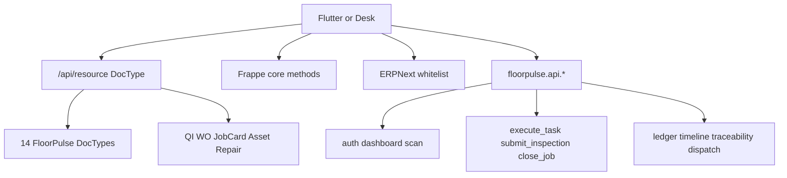
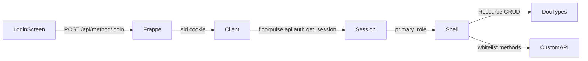

# FloorPulse — Developer Notes

Implementation details, local setup, and API reference for contributors.

---

## Repository Layout

```
floorpulse/
├── app/                    # Flutter mobile app (iOS + Android)
├── backend/
│   └── floorpulse/         # ERPNext custom app (Python / Frappe)
│       ├── setup.py
│       └── floorpulse/
│           ├── hooks.py
│           ├── setup/install.py    # after_install / after_migrate hooks
│           ├── data/seed_data.py   # Demo data seeder
│           ├── api/                # Custom whitelist methods
│           └── floorpulse/         # Main Frappe module
│               ├── workspace/      # FloorPulse workspace definition
│               ├── report/         # Pareto Analysis, Downtime Log
│               └── doctype/        # Custom DocTypes
│                   ├── customer_visit/
│                   ├── warehouse_task/
│                   ├── ncr/
│                   ├── loto/
│                   ├── gate_entry/
│                   ├── sales_memo/
│                   ├── promise_to_pay/
│                   ├── vendor_scorecard/
│                   ├── calibration/
│                   ├── quality_hold/
│                   ├── material_return/
│                   ├── subcontract_challan/
│                   ├── customer_complaint/
│                   └── floorpulse_notification/
├── Dockerfile
├── docker-compose.yml
├── Makefile
└── .env.example
```

---

## Custom DocTypes

FloorPulse adds only what ERPNext does not already provide. Inspections, repairs, work orders, and stock movements use built-in DocTypes.

| DocType | Module | Purpose |
|---|---|---|
| **Customer Visit** | FloorPulse | Sales site check-in/out, purpose, GPS, outcome |
| **Warehouse Task** | FloorPulse | Mixed mobile queue (GRN / put-away / pick / cycle count / transfer / returns). Execution is on the linked stock document. |
| **NCR** | FloorPulse | Manufacturing non-conformance (item, qty rejected, disposition) plus CAPA fields. Not ERPNext ISO **Non Conformance**. |
| **LOTO** | FloorPulse | Lockout/tagout register linked to Asset / Asset Repair / Maintenance Visit |
| **Gate Entry** | FloorPulse | Vehicle / party in-gate log (purpose, driver, status) |
| **Sales Memo** | FloorPulse | Voice or note memo linked to Customer / product interest |
| **Promise to Pay** | FloorPulse | Standalone PTP linked to Customer and optional Sales Invoice |
| **Vendor Scorecard** | FloorPulse | Lightweight supplier quality/delivery rating. Not ERPNext **Supplier Scorecard**. |
| **Calibration** | FloorPulse | Instrument / Asset calibration due date, result, next due |
| **Quality Hold** | FloorPulse | Hold / release of item (optional batch) with timestamps |
| **Material Return** | FloorPulse | Return request (customer / store / supplier). Warehouse execution stays on Warehouse Task `Returns Processing`. |
| **Subcontract Challan** | FloorPulse | Shop-floor send/receive vs a supplier. Not ERPNext **Subcontracting Order**. |
| **Customer Complaint** | FloorPulse | Customer complaint and resolution |
| **FloorPulse Notification** | FloorPulse | In-app alert for a user / shell. Not Frappe **Notification**. |

### Reuse ERPNext / Frappe instead of custom types

| Mobile feature | DocType |
|---|---|
| Incoming / in-process / outgoing inspection, readings, verdict | **Quality Inspection** |
| Breakdown job, consumed spares, downtime | **Asset Repair** |
| Customer-site field service | **Maintenance Visit** |
| Scheduled PM log | **Asset Maintenance Log** |
| Shop-floor jobs | **Work Order**, **Job Card** |
| GRN / pick / transfer / cycle count | **Purchase Receipt**, **Pick List**, **Stock Entry**, **Stock Reconciliation** |
| Packing cartons / weight | **Delivery Note** fields `fp_carton_count`, `fp_gross_weight`, `fp_cartons_sealed`, `fp_labels_affixed` |
| New quote / lead | **Quotation**, **Lead** |
| Photos, signatures, evidence | **File** attachments |
| Approvals | **Workflow** on Sales Order |
| Customer credit / payment terms | Customer **credit_limits** / **payment_terms** |
| Defect Pareto | Query Report **Pareto Analysis** (`ref_doctype` NCR) |
| Machine downtime | Query Report **Downtime Log** (`ref_doctype` Asset Repair) |

Custom fields on Asset, Maintenance Visit, Asset Repair, Asset Maintenance Log, Sales Order (`fp_visit_reference`), Purchase Receipt (`fp_grn_task_reference`), Delivery Note (packing), and Customer (`fp_segment`) carry FloorPulse-specific data on those built-ins. Asset also has `fp_meter_readings` (JSON) for named meters until a child table exists.

---

## Local Setup

### Prerequisites

- Docker Desktop v4.x or later
- `make`
- Port 8080 available on localhost

### First-time setup

```bash
# 1. Copy and edit environment file
cp .env.example .env
# Edit .env — change DB_PASSWORD and ADMIN_PASSWORD at minimum

# 2. Add site to /etc/hosts
echo "127.0.0.1  floorpulse.localhost" | sudo tee -a /etc/hosts

# 3. Build image, start services, create site, and seed demo data
make install
```

The ERPNext web UI will be available at `http://floorpulse.localhost:8080`.  
Login: `Administrator` / the `ADMIN_PASSWORD` you set in `.env`.

---

## Daily Commands

| Command | What it does |
|---|---|
| `make start` | Start all services |
| `make stop` | Stop all services |
| `make restart` | Restart all services |
| `make logs` | Tail logs from all containers |
| `make shell` | Open a bash shell in the backend container |
| `make bench CMD="list-apps"` | Run any `bench` command |
| `make migrate` | Apply schema changes and patches |
| `make seed` | Re-seed demo data (idempotent). Creates company **FloorPulse Demo** via the ERPNext setup wizard if the site has none. |
| `make test` | Run helper unit tests (pytest, no bench) |
| `make test-api` | Run FloorPulse API integration tests inside Docker (`bench run-tests`) |

---

## Danger Zone

```bash
make reset-site   # Drop & recreate the ERPNext site (data loss)
make nuke         # Remove all containers and Docker volumes (full reset)
```

Both commands prompt for confirmation before executing.

---

## REST API

Same principle as custom DocTypes: FloorPulse adds only what Frappe/ERPNext does not already provide. The Flutter app is mock-only. Connecting it should default to `/api/resource/<DocType>` plus existing Frappe/ERPNext methods — not a parallel API layer. Custom whitelist methods live in `floorpulse/api/` and cover only aggregations or atomic multi-doc posting.

Primary client: shop-floor mobile / PWA.

Demo users (after `make seed`):

| Username | Password | Shell |
|---|---|---|
| `production` | `prod123` | production |
| `qc` | `qc123` | qc |
| `warehouse` | `wh123` | warehouse |
| `sales` | `sales123` | sales |
| `maintenance` | `maint123` | maintenance |

Login with the username or the email `username@floorpulse.local`.

```bash
# Authenticate
POST /api/method/login
{"usr": "user@example.com", "pwd": "password"}

# List Customer Visits
GET /api/resource/Customer Visit?filters=[["status","=","Completed"]]

# Create a new Customer Visit
POST /api/resource/Customer Visit
Content-Type: application/json
{"customer": "Acme Corp", "sales_person": "...", "visit_date": "2024-06-01", ...}

# Quality Inspection (ERPNext)
GET /api/resource/Quality Inspection

# Asset Repair (ERPNext)
GET /api/resource/Asset Repair
```

The same Resource pattern applies to `Warehouse Task`, `NCR`, `LOTO`, `Gate Entry`, `Sales Memo`, `Promise to Pay`, `Vendor Scorecard`, `Calibration`, `Quality Hold`, `Material Return`, `Subcontract Challan`, `Customer Complaint`, `FloorPulse Notification`, `Work Order`, `Pick List`, and other DocTypes — substitute the name in the URL.

Mobile auth: cookie jar on `login`, or `Authorization: token api_key:api_secret`. No custom auth server.

### Reuse — Frappe Resource API

Standard verbs on every DocType (auth required):

- `GET /api/resource/{DocType}` — list (`filters`, `fields`, `limit_start`, `limit_page_length`, `order_by`)
- `GET /api/resource/{DocType}/{name}` — get (includes child tables)
- `POST` create / `PUT` update / `DELETE`
- Submit/cancel via Frappe client methods (below), not a custom endpoint

#### Custom FloorPulse DocTypes

| Mobile action | Resource call |
|---|---|
| Schedule visit | `POST /api/resource/Customer Visit` |
| Check-in / GPS / check-out / outcome | `PUT` Customer Visit (`status`, `check_in_time`, `check_out_time`, `location_*`, `outcome`, `notes`) then `frappe.client.submit` |
| Warehouse queue list | `GET` Warehouse Task `filters=[["assigned_to","=",user]]` |
| Raise NCR / CAPA / close NCR | `POST`/`PUT` NCR (CAPA is fields on NCR, not a separate DocType) |
| LOTO register, apply, remove | `GET`/`PUT` LOTO (`status` auto-stamps `applied_on` / `removed_on` in the LOTO controller) |
| Gate in/out | `POST`/`PUT` Gate Entry |
| Sales memo | `POST`/`PUT` Sales Memo |
| Record PTP | `POST` Promise to Pay (`customer`, `promise_amount`, `expected_date`, optional `sales_invoice`) |
| Packing cartons / weight | `PUT` Delivery Note (`fp_carton_count`, `fp_gross_weight`, `fp_cartons_sealed`, `fp_labels_affixed`) |
| Vendor scorecard | `POST`/`PUT` Vendor Scorecard |
| Calibration | `POST`/`PUT` Calibration |
| Hold / release | `PUT` Quality Hold (`status` stamps `held_on` / `released_on`) |
| Material return request | `POST`/`PUT` Material Return |
| Subcontract send/receive | `POST`/`PUT` Subcontract Challan |
| Customer complaint | `POST`/`PUT` Customer Complaint |
| In-app notification | `GET` FloorPulse Notification `filters=[["for_user","=",user]]` |

#### ERPNext DocTypes the app already maps to

| Role | List / detail via Resource |
|---|---|
| Production | Work Order, Job Card |
| QC | Quality Inspection (readings child table), Batch |
| Warehouse | Purchase Order, Purchase Receipt, Pick List, Stock Entry, Stock Reconciliation, Material Request, Delivery Note, Item, Bin, Warehouse, Stock Ledger Entry |
| Sales | Customer, Sales Order, Sales Invoice, Quotation, Lead, Payment Entry, Delivery Note |
| Maintenance | Asset, Asset Repair, Maintenance Visit, Asset Maintenance Log, Material Request |

Child tables (QI readings, SO items, PR items, Asset Repair consumed items, Job Card time logs) travel with the parent GET/PUT. Do not invent per-child APIs.

File / photo / signature: `POST /api/method/upload_file` then set the Attach field (`visit_photo`, `fp_customer_signature`). Print: Frappe print-format download (`download_pdf`).

### Reuse — Frappe core methods

| Need | Method |
|---|---|
| Login / logout | `POST /api/method/login`, `logout` |
| Who am I | `frappe.auth.get_logged_user` |
| Counts for simple KPIs | `frappe.client.get_count` |
| Submit / cancel | `frappe.client.submit` / `cancel` |
| Link search | `frappe.desk.search.search_link` |
| Workflow approve/reject (Sales Order) | `frappe.model.workflow.apply_workflow` |
| Assignment | `frappe.desk.form.assign_to.add` |
| Comments | `frappe.desk.form.utils.add_comment` |
| Reports (Pareto, Stock Ledger, downtime) | `frappe.desk.query_report.run` — **Pareto Analysis**, **Downtime Log**, **Stock Ledger** |
| PDF | `frappe.utils.print_format.download_pdf` |

### Reuse — ERPNext whitelist methods

Do not reimplement stock/manufacturing posting in FloorPulse. Call these from Flutter or from the thin wrappers below.

| Flow | Existing method (ERPNext v15) |
|---|---|
| GRN from PO | `erpnext.buying.doctype.purchase_order.purchase_order.make_purchase_receipt` then Resource PUT lines (qty/batch) then `frappe.client.submit` |
| Material issue / put-away / transfer | Resource POST **Stock Entry** (`Material Issue` / `Material Transfer`) then submit |
| Pick → Delivery Note | `erpnext.stock.doctype.pick_list.pick_list.create_delivery_note` / `create_stock_entry` |
| Job start / complete | Job Card time logs on the document; `erpnext.manufacturing.doctype.work_order.work_order.make_stock_entry` for finish/consume |
| Payment against invoice/SO | `erpnext.accounts.doctype.payment_entry.payment_entry.get_payment_entry` then insert + submit |
| Item/batch/serial barcode | `erpnext.stock.utils.scan_barcode` (Item / Batch / Serial only) |
| Stock balance | Query Report **Stock Ledger** / **Stock Balance** |
| Consume spares | Asset Repair `consumed_items` via Resource, or Material Request if qty = 0 |

**E-way bill:** the image is `frappe/erpnext:version-15` only — no `india_compliance`. GSTN generate/print is out of scope until that app is added. The Flutter e-way screen stays mock.

### API implementation plan

Build a method only when Resource/ERPNext cannot do it in one safe round-trip: aggregations, multi-DocType scan, or atomic multi-doc posting the Flutter client should not orchestrate.

Package: `floorpulse/api/`. All methods require a logged-in session (`POST /api/method/login` or token header). Call as `POST /api/method/<dotted.path>`. Frappe exposes `@frappe.whitelist()` by dotted path — `hooks.py` does not list them.



#### Status

| Layer | State |
|---|---|
| Resource CRUD | **Live** for all 14 FloorPulse DocTypes and the ERPNext types the app maps to |
| Whitelist methods in `floorpulse/api/` | **Implemented** — nine original wrappers plus B1 hardening and B2 aggregations (see contracts below) |
| Wrapper hardening, aggregations, notification hooks, API tests | **Implemented** (Phases B1–B3) |
| Flutter HTTP client | **Mock-only** (Phase B4 / Flutter plan below) |

Helper unit tests: `floorpulse/api/test_api_helpers.py` (`make test`). Integration tests: `floorpulse/api/test_api.py` (`make test-api`).

#### DocType coverage

| DocType | Client call | Notes |
|---|---|---|
| **Customer Visit** | Resource CRUD + `frappe.client.submit` | Check-in / GPS / check-out are PUT fields |
| **Warehouse Task** | Resource list; **`execute_task`** to post stock | Queue only; execution is the linked PR / SE / Pick List / SR |
| **NCR** | Resource CRUD | CAPA is fields on NCR. Reject-from-QI uses **`submit_inspection`** |
| **LOTO** | Resource PUT (`status` stamps timestamps) | Closeout of a repair uses **`close_job`** |
| **Gate Entry** | Resource CRUD | Dispatch also upserts a row via **`warehouse.dispatch`** |
| **Sales Memo** | Resource CRUD | Voice file via `upload_file`; no transcription API |
| **Promise to Pay** | Resource CRUD | Does not post Payment Entry |
| **Vendor Scorecard** | Resource CRUD | Coming-soon Flutter UI; DocType is live |
| **Calibration** | Resource CRUD | Coming-soon Flutter UI |
| **Quality Hold** | Resource PUT (`status` stamps timestamps) | Coming-soon hold UI; Final Pass may release via `submit_inspection` `release_hold` |
| **Material Return** | Resource CRUD (request) | Stock posting is Warehouse Task `Returns Processing` + **`execute_task`** |
| **Subcontract Challan** | Resource CRUD | Shop-floor log, not ERPNext Subcontracting Order |
| **Customer Complaint** | Resource CRUD | Coming-soon Flutter UI |
| **FloorPulse Notification** | Resource GET/PUT (`read`) | Clients cannot create (except System Manager). `doc_events` / daily scheduler insert rows |
| **Quality Inspection** | Resource (readings) then **`submit_inspection`** | Custom field `fp_verdict` (`Pass` / `Conditional Accept` / `Reject`) |
| **Work Order** / **Job Card** | Resource; **`start_job`** / **`complete_job`** | Finish/consume Stock Entry stays ERPNext `make_stock_entry`. `complete_job` optional `submit=1` |
| **Purchase Order** / **Purchase Receipt** / **Pick List** / **Stock Entry** / **Stock Reconciliation** | Resource + **`execute_task`** | Assignee enforced unless Stock Manager |
| **Delivery Note** | Resource PUT `fp_*` packing; **`warehouse.dispatch`** | |
| **Customer** / **Sales Order** / **Sales Invoice** / **Quotation** / **Lead** | Resource | Outstanding/ledger via **`sales.customer_ledger`**; SO timeline via **`sales.fulfilment_timeline`** |
| **Payment Entry** | `get_payment_entry` then insert + submit | |
| **Asset** / **Asset Repair** / **Maintenance Visit** / **Asset Maintenance Log** | Resource; **`close_job`**, **`save_meter_readings`** | `close_job` LOTO scoped to this repair (or empty reference) |
| **Item** / **Batch** / **Bin** / **Warehouse** | Resource; **`scan.resolve`**; **`qc.traceability`** | Flat SLE stays on query report **Stock Ledger** |
| Query Report **Pareto Analysis** / **Downtime Log** / **Stock Ledger** | `frappe.desk.query_report.run` | |

One-shot paths now live: `sales.customer_ledger`, `sales.fulfilment_timeline`, `qc.traceability`, `warehouse.dispatch`, Conditional Accept / `release_hold`, notification creation via hooks, `unreadNotifications` on every dashboard.

#### Live whitelist methods (Implemented)

| Method | Why custom | What it wraps |
|---|---|---|
| `floorpulse.api.auth.get_session` | Login does not return Employee, FloorPulse role, default Warehouse, Sales Person | User + Employee + roles → which home shell to open |
| `floorpulse.api.dashboard.get` | KPIs are not DocType GETs (pass %, MTTR, collection vs target, efficiency) | Permission-aware counts + aggregates; one payload per role including `unreadNotifications` |
| `floorpulse.api.scan.resolve` | One code may be Item, Batch, Serial, Asset, Job Card, PO, Bin, Warehouse Task, QI, Asset Repair, NCR, Gate Entry | Tries `scan_barcode` first, then fallbacks; skips hits the session cannot read |
| `floorpulse.api.warehouse.execute_task` | Warehouse Task is a queue; execution must post PR / Stock Entry / Pick List / Stock Reconciliation and complete the task atomically | ERPNext make_* + submit + Warehouse Task submit; assignee check |
| `floorpulse.api.warehouse.dispatch` | DN submit + Gate Entry close must roll back together | Submit Delivery Note; upsert Gate Entry `purpose=Delivery` `status=Closed` |
| `floorpulse.api.qc.submit_inspection` | Verdict + optional NCR + optional hold release in one action | QI submit + `fp_verdict`; optional `POST` NCR; optional Quality Hold release |
| `floorpulse.api.qc.traceability` | Batch / serial / item tree is not a Resource GET | Walks Batch + SLE + manufacture Stock Entry; node types match Flutter `TraceabilityNode` |
| `floorpulse.api.production.start_job` / `complete_job` | Raw Job Card time-log child tables are easy to get wrong on mobile | Job Card time log start/end + qty; optional Job Card submit |
| `floorpulse.api.maintenance.close_job` | Close = Asset Repair submit + signature File + LOTO Removed in one action | Asset Repair + `upload_file` field + LOTO scoped to this repair |
| `floorpulse.api.maintenance.save_meter_readings` | `fp_meter_reading` is a single float; Flutter has named meters (Hours, Cycles) | Named meters persist on Asset `fp_meter_readings` (JSON); Hours (or first value) also written to `fp_meter_reading` |
| `floorpulse.api.sales.customer_ledger` | Outstanding + credit limit + AR rows are not one Customer GET | SI outstanding, `credit_limits`, `payment_terms`, Invoice/Payment/Credit Note entries |
| `floorpulse.api.sales.fulfilment_timeline` | SO fulfilment is split across WO / Pick List / DN / PE | Linked documents in that order |

Notification create is **not** a client POST. `floorpulse.api.notifications.notify` is internal. Hooks insert rows on NCR insert, Asset Repair insert, QI Rejected, Quality Hold Held. Daily: overdue Warehouse Task, Calibration due.

##### Request / response shapes (Implemented)

**`floorpulse.api.auth.get_session`** — no args.

```json
{
  "user": "qc@floorpulse.local",
  "full_name": "Priya Sharma",
  "employee": {"name": "HR-EMP-00001", "employee_name": "Priya Sharma", "department": null},
  "primary_role": "qc",
  "roles": ["qc"],
  "default_warehouse": null,
  "sales_person": null
}
```

Role map (first match is `primary_role`): Quality Manager → `qc`; Stock User/Manager → `warehouse`; Sales User/Manager → `sales`; Maintenance User/Manager → `maintenance`; Manufacturing User/Manager → `production`. Users with only System Manager get `primary_role: null` and `roles: []`.

**`floorpulse.api.dashboard.get`** — optional `role` (`production` \| `qc` \| `warehouse` \| `sales` \| `maintenance`). Defaults to `primary_role`. System Manager may request any role.

```json
{"role": "qc", "inspectionsToday": 14, "ncrsRaised": 3, "passRatePct": 91, "pendingQueue": 7, "rejectionPct": 9, "overdueCapas": 2, "unreadNotifications": 3}
```

Production keys: `activeWorkOrders`, `completedToday`, `productionEfficiency`, `openAlerts`, `pendingInspections`, `onTimeDelivery`.  
Warehouse keys: `pendingGRNs`, `pendingPutAways`, `issueRequests`, `pickLists`, `countsDue`, `stockAlerts`.  
Sales keys: `todayVisits`, `pendingApprovals`, `openOrders`, `collectionMTD`, `targetMTD`.  
Maintenance keys: `machinesDown`, `overduePM`, `mttr`, `sparesLow`.  
Every role also has `unreadNotifications` (`FloorPulse Notification` where `for_user=session` and `read=0`). KPI counts skip DocTypes the session cannot read.

**`floorpulse.api.scan.resolve`** — `code`.

```json
{"type": "Item", "doctype": "Item", "name": "RM-SS316-25", "label": "SS316 Round Bar", "extra": {}}
```

Throws if nothing matches. Order: `scan_barcode` (Serial / Batch / Item), Asset `fp_asset_tag` then name, Job Card, Work Order, Purchase Order, Bin, Warehouse Task, Quality Inspection, Asset Repair, NCR, Gate Entry (`name` then `vehicle_number`). After each hit, `frappe.has_permission(doctype, "read", name)` — unpermitted hits are skipped (existence is not leaked).

**`floorpulse.api.warehouse.execute_task`** — `task` (Warehouse Task name), `lines` list of `{item_code, qty, batch_no?, serial_no?, from_bin?, to_bin?}`.

```json
{"task": "FP-WT-2026-00001", "status": "Completed", "posted_doctype": "Purchase Receipt", "posted_name": "PR-00001"}
```

Rolls back if posting or task submit fails. GRN / Picking / Returns Processing require `reference_document`. Empty GRN `lines` submits the full PO receipt. Put-Away / Issue / Transfer / Cycle Count require lines. If `assigned_to` is set and is not the session user, throws unless the user has **Stock Manager**.

Handlers: GRN → Purchase Receipt; Put-Away / Stock Transfer → Stock Entry Material Transfer; Issue → Stock Entry Material Issue; Picking → submit Pick List then DN or Stock Entry; Cycle Count → Stock Reconciliation; Returns Processing → return PR/DN, else Material Receipt.

**`floorpulse.api.qc.submit_inspection`** — `quality_inspection`, `status` (`Accepted` \| `Rejected`), optional `verdict` (`Pass` \| `Conditional Accept` \| `Reject`), optional `release_hold`, `ncr` object required on reject (`defect_type` required; `item_code`, `quantity_rejected`, `severity`, `disposition`, `notes`, CAPA fields optional). If `verdict` is omitted, `Accepted` ⇒ Pass and `Rejected` ⇒ Reject.

```json
{
  "quality_inspection": "QI-00001",
  "status": "Accepted",
  "verdict": "Conditional Accept",
  "ncr": null,
  "hold_released": null
}
```

Put QI readings via Resource before this call. Conditional Accept → QI `Accepted` + `fp_verdict`. Reject still inserts a draft NCR. `release_hold=1` with verdict Pass releases matching Held Quality Hold rows (`item_code`, and `batch_no` when both set). Conditional Accept does not release holds.

**`floorpulse.api.production.start_job`** — `job_card`.

```json
{"job_card": "JC-00001", "status": "Work In Progress", "from_time": "2026-08-15 12:00:00"}
```

Works on **draft** Job Cards only (`docstatus == 1` rejected). Appends a time log with `from_time` and session Employee when mapped.

**`floorpulse.api.production.complete_job`** — `job_card`, optional `completed_qty`, optional `submit` (default `0`). Closes the open time log. When `submit=1`, submits the Job Card. Does not call `work_order.make_stock_entry`.

```json
{"job_card": "JC-00001", "status": "Work In Progress", "to_time": "2026-08-15 13:30:00", "completed_qty": 10}
```

**`floorpulse.api.maintenance.close_job`** — `asset_repair`, optional `signature` (File URL from `upload_file`), optional `checklist_completed`. Submits Asset Repair and sets Applied LOTO rows to Removed where `asset` matches **and** `reference_document` is this Asset Repair or empty.

```json
{"asset_repair": "AR-00001", "status": "Completed", "loto_removed": ["FP-LOTO-2026-00001"]}
```

**`floorpulse.api.maintenance.save_meter_readings`** — `asset`, `readings` e.g. `{"Hours": 1234, "Cycles": 56}`.

```json
{"asset": "AST-00001", "fp_meter_reading": 1234, "readings": {"Hours": 1234, "Cycles": 56}}
```

Does not update `fp_next_pm_date`. No meter history child table.

**`floorpulse.api.sales.customer_ledger`** — `customer`. Outstanding from submitted Sales Invoices, credit limit from Customer `credit_limits` (default company), `payment_terms`, and AR rows shaped like Flutter `LedgerEntry` (positive debit / negative credit, running `balance`).

```json
{
  "customer": "CUST-00001",
  "outstanding": 248500.0,
  "credit_limit": 500000.0,
  "payment_terms": "Net 30",
  "entries": [
    {"date": "2026-08-01", "type": "Invoice", "reference": "SINV-00001", "amount": 50000.0, "balance": 248500.0}
  ]
}
```

**`floorpulse.api.sales.fulfilment_timeline`** — `sales_order`. Linked Work Order, Pick List, Delivery Note, Payment Entry (only rows that exist). Draft documents have `date: null`.

```json
{
  "sales_order": "SO-00001",
  "steps": [
    {"doctype": "Work Order", "name": "WO-00001", "status": "In Process", "date": "2026-08-10"},
    {"doctype": "Pick List", "name": "PL-00001", "status": "Completed", "date": "2026-08-12"},
    {"doctype": "Delivery Note", "name": "DN-00001", "status": "Draft", "date": null},
    {"doctype": "Payment Entry", "name": "PE-00001", "status": "Submitted", "date": "2026-08-14"}
  ]
}
```

**`floorpulse.api.qc.traceability`** — `code` (batch / serial / item). Tree walking Batch + Stock Ledger Entry + manufacture Stock Entry. Flat movements stay on query report **Stock Ledger**. Node `type` values: `batch` | `material` | `product` | `supplier`.

```json
{
  "code": "BATCH-001",
  "root": {
    "id": "BATCH-001",
    "label": "SS316 Round Bar",
    "type": "batch",
    "detail": "Item RM-SS316-25",
    "children": []
  }
}
```

**`floorpulse.api.warehouse.dispatch`** — `delivery_note`, `vehicle_number`, `driver_name`. Packing `fp_*` fields are PUT on the DN via Resource first. Submits the DN and upserts Gate Entry (`purpose=Delivery`, `status=Closed`) in one transaction.

```json
{"delivery_note": "DN-00001", "status": "Submitted", "gate_entry": "FP-GE-2026-00001"}
```

#### Phases B1–B3 (Implemented)

B1 hardened the original wrappers (`complete_job` `submit`, scoped LOTO, `fp_verdict` / Conditional Accept / `release_hold`, assignee check, `has_permission` on scan/dashboard, `unreadNotifications`, scan fallbacks). B2 added `sales.py`, `qc.traceability`, `warehouse.dispatch`, and `notifications.py` hooks. B3 added `test_api.py` (FrappeTestCase, `make test-api`) alongside helper tests (`make test`).

#### Intentionally not custom

Looks like an API, but Resource / Frappe / ERPNext is enough:

- Check-in / check-out / GPS
- Standalone NCR + CAPA CRUD
- LOTO apply/remove (except as part of `close_job`)
- Start inspection (QI status before verdict)
- Customer / SO / Quotation / Lead **lists** (ledger and fulfilment timeline are whitelist methods above)
- Asset / job lists
- Workflow approve (`apply_workflow`)
- Logout, `upload_file`, `download_pdf`
- Packing PUT on Delivery Note
- Pareto / Stock Ledger / Downtime reports (`query_report.run`)

Coming-soon Flutter snackbars (scorecard, calibration, hold/release **UI**, returns, subcontracting, complaints, notifications **list**) stay Resource when the UI is built — DocTypes already exist. E-way bill stays mock (no `india_compliance`). Offline batch sync: **defer** until Resource CRUD is live online.

#### Role map

| Role | Reuse | Live |
|---|---|---|
| Auth | `login` / `logout` / `upload_file` | `get_session` |
| Production | Resource WO / Job Card; `add_comment`; `make_stock_entry` | `get_session`, dashboard (`unreadNotifications`), `scan.resolve`, `start_job` / `complete_job` (`submit`) |
| QC | Resource QI + NCR + Vendor Scorecard + Quality Hold + Calibration; Query Report Pareto / Stock Ledger | dashboard, `scan.resolve`, `submit_inspection` (`verdict` / `release_hold`), `qc.traceability` |
| Warehouse | Resource PO / Task / Bin / Item / Gate Entry / Material Return / Subcontract Challan; packing PUT DN | dashboard, `scan.resolve`, `execute_task` (assignee check), `warehouse.dispatch` |
| Sales | Resource Customer / Visit / SO / SI / Quotation / Lead / Sales Memo / Promise to Pay / Customer Complaint; `apply_workflow`; `get_payment_entry` | dashboard, `sales.customer_ledger`, `sales.fulfilment_timeline` |
| Maintenance | Resource Asset / Asset Repair / LOTO / Maintenance Visit / Calibration; Query Report Downtime Log | dashboard, `scan.resolve`, `close_job` (scoped LOTO), `save_meter_readings` |
| All shells | Resource FloorPulse Notification GET/PUT | `unreadNotifications`; hooks create rows |

---

## Flutter API Integration Plan

Phase B4 of the API plan: wire the mock app to the APIs above. No Python in this phase.

The Flutter app in `app/` is mock-only. Login hardcodes demo usernames in `app/lib/screens/auth/login_screen.dart`. Screens import `*_mock_data.dart` directly. There is no HTTP client, no session, and no `INTERNET` permission in `app/android/app/src/main/AndroidManifest.xml`.

Connect the app to the APIs above. Do not add a parallel API layer. Default to `/api/resource/<DocType>` and existing Frappe/ERPNext methods. Call FloorPulse whitelist methods for the nine live wrappers plus B1/B2 additions (`customer_ledger`, `fulfilment_timeline`, `traceability`, `dispatch`).

### Current state → target



Keep mock data behind `--dart-define=USE_MOCK=true` during the cutover. Drop the mock import for a shell once that phase is live.

### Client foundation

Suggested packages: `dio` + `cookie_jar` + `dio_cookie_manager` (Frappe `sid` cookie) and `provider` for session. Do not introduce Riverpod or Bloc unless a later need appears.

Base URL: `--dart-define=FRAPPE_URL=http://floorpulse.localhost:8080` on the simulator. Use the machine LAN IP for a physical device.

Platform:

- Android: `INTERNET` permission and cleartext HTTP for localhost.
- iOS: ATS exception for local HTTP.

Error mapping: `frappe.throw` / `_server_messages` → snackbar. Screens keep UI; they stop importing `*_mock_data.dart` once that shell's phase is done.

Suggested layout (not created yet):

```
app/lib/api/frappe_client.dart      # Dio + cookie jar, login/logout, method POST
app/lib/api/session.dart            # get_session → AppUser / primary_role
app/lib/api/resource.dart           # GET/POST/PUT /api/resource/<DocType>
app/lib/api/floorpulse_api.dart     # dashboard, scan, execute_task, start_job, ledger, …
```

### Phased screen-to-API map

#### Phase 0 — Foundation (no UI change)

`FrappeClient`, cookie jar, `fromJson` on models, error mapping. No screen wiring yet.

#### Phase 1 — Auth

| Screen | Call | Replaces |
|---|---|---|
| `screens/auth/login_screen.dart` | `POST /api/method/login` then `floorpulse.api.auth.get_session` | Hardcoded username/password switch |
| More screens (all five shells) | `POST /api/method/logout` | Local `Navigator` pop to login |

Route `primary_role` to the existing homes: `production` → `HomeScreen`, `qc` → `QCHomeScreen`, `warehouse` → `WarehouseHomeScreen`, `sales` → `SalesHomeScreen`, `maintenance` → `MaintenanceHomeScreen`. Demo users already match seed (`production` / `qc` / `warehouse` / `sales` / `maintenance`).

#### Phase 2 — Dashboards

KPI keys on the five dashboards already match `floorpulse.api.dashboard.get`. One call per shell (`role` optional; defaults to `primary_role`). After B1, every payload also has `unreadNotifications`.

| Screen | Keys already used |
|---|---|
| `screens/dashboard/dashboard_screen.dart` | `activeWorkOrders`, `completedToday`, `productionEfficiency`, `openAlerts`, `pendingInspections`, `onTimeDelivery` |
| `screens/qc/qc_dashboard_screen.dart` | `inspectionsToday`, `ncrsRaised`, `passRatePct`, `pendingQueue`, `rejectionPct`, `overdueCapas` |
| `screens/warehouse/home/warehouse_dashboard_screen.dart` | `pendingGRNs`, `pendingPutAways`, `issueRequests`, `pickLists`, `countsDue`, `stockAlerts` |
| `screens/sales/dashboard/sales_dashboard_screen.dart` | `todayVisits`, `pendingApprovals`, `openOrders`, `collectionMTD`, `targetMTD` |
| `screens/maintenance/dashboard/maintenance_dashboard_screen.dart` | `machinesDown`, `overduePM`, `mttr`, `sparesLow` |

Drop `MockData.dashboardStats`, `QCMockData.qcDashboardStats`, and the other `dashboardStats` maps.

#### Phase 3 — Scan

All scan screens call `floorpulse.api.scan.resolve` with the scanned `code`, then navigate by `doctype`:

| `doctype` | Open |
|---|---|
| Job Card | job detail |
| Work Order | work order detail |
| Asset | asset detail |
| Asset Repair | job execution |
| Quality Inspection | inspection detail |
| NCR | NCR detail |
| Purchase Order | GRN / PO detail |
| Gate Entry | gate form / list |
| Bin | bin contents |
| Warehouse Task | matching task flow |
| Item / Batch / Serial No | stock / `qc.traceability` |

Screens: `screens/scan/scan_screen.dart`, `screens/qc/scan/qc_scan_screen.dart`, `screens/warehouse/scan/warehouse_scan_screen.dart`, `screens/maintenance/scan/maintenance_scan_screen.dart`. Production scan should open WO / Job Card detail (today it shows a hardcoded sheet).

#### Phase 4 — Production

| Screen | Call |
|---|---|
| `screens/home/home_screen.dart` | Tab shell only; KPIs from Phase 2 |
| `screens/work_orders/work_orders_screen.dart` | Resource `Work Order` list |
| `screens/work_orders/work_order_detail_screen.dart` | Resource `Work Order/{name}`. Status update snackbar stays coming-soon |
| `screens/my_jobs/my_jobs_screen.dart` | Resource `Job Card` filtered by session Employee |
| `screens/my_jobs/job_detail_screen.dart` Start / Complete | `start_job` / `complete_job` (`submit=1` after B1 when the operator marks the job done) |
| Job notes | `frappe.desk.form.utils.add_comment` |
| `screens/more/more_screen.dart` | Logout; Profile / Settings / Reports / Notifications / Help stay coming-soon snackbars |

Finish/consume stock is **not** `complete_job`. Call `erpnext.manufacturing.doctype.work_order.work_order.make_stock_entry` only when the UI adds a finish/consume action.

Replaces `data/mock_data.dart`.

#### Phase 5 — QC

| Screen | Call |
|---|---|
| Queue / `inspection_detail_screen` / `reading_entry_screen` | Resource `Quality Inspection` (PUT readings child table **before** verdict) |
| `screens/qc/queue/verdict_screen.dart` Pass | `submit_inspection` with `status=Accepted`, `verdict=Pass` |
| Same screen Conditional Accept | `submit_inspection` with `status=Accepted`, `verdict=Conditional Accept` (B1) |
| Same screen Final Pass “Release for Dispatch” | `submit_inspection` with `release_hold=1` (B1) |
| `screens/qc/queue/create_ncr_screen.dart` Reject | `submit_inspection` with `status=Rejected`, `verdict=Reject`, and `ncr` (`defect_type` required) |
| NCR list / detail / CAPA | Resource `NCR` (CAPA is fields on NCR, not a separate DocType) |
| `screens/qc/queue/evidence_screen.dart` | `POST /api/method/upload_file` (photo capture / add note snackbars stay coming-soon) |
| `screens/qc/scan/traceability_tree_screen.dart` | `floorpulse.api.qc.traceability` |
| `screens/reports/pareto_report_screen.dart` | `frappe.desk.query_report.run` **Pareto Analysis** |
| `screens/qc/scan/stock_ledger_screen.dart` | `frappe.desk.query_report.run` **Stock Ledger** |
| `screens/qc/more/qc_more_screen.dart` | Traceability is live; Supplier Scorecard / Calibration / Hold-Release stay Resource when those UIs are built |

Replaces `data/qc_mock_data.dart`.

#### Phase 6 — Warehouse

| Screen | Call |
|---|---|
| `screens/warehouse/tasks/tasks_screen.dart` | Resource `Warehouse Task` `filters=[["assigned_to","=",user]]` |
| GRN list / detail / batch / review | Resource `Purchase Order`; submit via `execute_task` (`task_type` GRN) |
| `screens/warehouse/grn/grn_label_screen.dart` | `frappe.utils.print_format.download_pdf` |
| Put-away / issue / pick execution / cycle count | `execute_task` with `task` + `lines: [{item_code, qty, batch_no?, serial_no?, from_bin?, to_bin?}]` |
| `screens/warehouse/more/transfer_screen.dart` | `execute_task` Stock Transfer |
| `screens/warehouse/pick/packing_screen.dart` | Resource PUT Delivery Note `fp_carton_count`, `fp_gross_weight`, `fp_cartons_sealed`, `fp_labels_affixed` |
| `screens/warehouse/pick/dispatch_screen.dart` | `floorpulse.api.warehouse.dispatch` (`delivery_note`, `vehicle_number`, `driver_name`) after packing PUT |
| `screens/warehouse/more/gate_entry_screen.dart` | Resource `Gate Entry` (in/out form; dispatch also upserts a Closed Delivery entry) |
| `screens/warehouse/stock/stock_screen.dart` | Resource `Item` / `Bin` |
| `screens/warehouse/stock/bin_contents_screen.dart` | Resource `Bin` |
| `screens/warehouse/stock/warehouse_browser_screen.dart` | Resource `Warehouse` |
| Stock ledger (from warehouse More) | Same `query_report.run` **Stock Ledger** as QC |
| `screens/warehouse/more/warehouse_more_screen.dart` | Material Returns / Subcontracting stay Resource when those UIs are built |

`execute_task` posts PR / Stock Entry / Pick List / Stock Reconciliation and submits the Warehouse Task atomically. GRN / Picking / Returns Processing require `reference_document` on the task. Flutter `WarehouseTaskType` must gain `stockTransfer` and `returnsProcessing` to match the DocType.

Replaces `data/warehouse_mock_data.dart`.

#### Phase 7 — Sales

| Screen | Call |
|---|---|
| Visit list / `new_visit_screen` / `checkin_screen` | Resource `Customer Visit` (`Planned` → `Checked In` → `Completed`; GPS on `location_latitude` / `location_longitude`) |
| `screens/sales/customers/customer_list_screen.dart` | Resource `Customer` |
| `screens/sales/customers/customer_detail_screen.dart` profile | Resource `Customer` |
| Same screen ledger / outstanding | `floorpulse.api.sales.customer_ledger` |
| `screens/sales/customers/invoice_detail_screen.dart` | Resource `Sales Invoice/{name}` |
| `screens/sales/customers/record_ptp_screen.dart` | Resource `Promise to Pay` |
| `screens/sales/orders/order_list_screen.dart` / `so_detail_screen.dart` | Resource `Sales Order` |
| `screens/sales/orders/fulfilment_timeline_screen.dart` | `floorpulse.api.sales.fulfilment_timeline` |
| `screens/sales/orders/delivery_note_screen.dart` | Resource `Delivery Note` |
| `screens/sales/orders/work_order_screen.dart` | Resource `Work Order` (read-only from SO) |
| `screens/sales/dashboard/approval_detail_screen.dart` | `frappe.model.workflow.apply_workflow` (SO workflow). Credit-limit / return approval types that are not SO workflow stay mock |
| `screens/sales/orders/payments_screen.dart` | `get_payment_entry` then insert + submit |
| `screens/sales/memo/memo_screen.dart` | Resource `Sales Memo`; voice file via `upload_file` (no STT API — fake transcription stays mock) |
| `screens/sales/more/quotations_screen.dart` / `leads_screen.dart` | Resource `Quotation` / `Lead` **lists**. FAB “New quotation / New lead” stays coming-soon |
| `screens/sales/orders/eway_bill_screen.dart` | Stay mock (no `india_compliance`) |
| `screens/sales/more/sales_more_screen.dart` | Complaints stay Resource when that UI is built |

Replaces `data/sales_mock_data.dart`.

#### Phase 8 — Maintenance

| Screen | Call |
|---|---|
| `screens/maintenance/assets/asset_list_screen.dart` / `asset_detail_screen.dart` | Resource `Asset`. Reschedule PM snackbar stays coming-soon |
| `screens/maintenance/jobs/job_list_screen.dart` / `job_execution_screen.dart` | Resource `Asset Repair` PUT (start is not a custom method) |
| `screens/maintenance/more/breakdown_queue_screen.dart` | Resource `Asset Repair` filtered by failure |
| Checklist / consume spares | Resource PUT child tables / `consumed_items` |
| `screens/maintenance/assets/meter_reading_screen.dart` | `floorpulse.api.maintenance.save_meter_readings` |
| `screens/maintenance/jobs/closeout_screen.dart` | `upload_file` then `floorpulse.api.maintenance.close_job` |
| `screens/maintenance/more/handover_screen.dart` | Resource `Asset Repair` `docstatus=1` + `fp_customer_signature` (not a new method) |
| `screens/maintenance/more/loto_screen.dart` | Resource **LOTO** (`status` stamps `applied_on` / `removed_on`). Do not map `MaintenanceJob.lotoStatus` as a field on Asset Repair |
| Vendor visits / PM calendar | Resource `Maintenance Visit` / `Asset Maintenance Log`. Schedule-vendor FAB stays coming-soon |
| `screens/maintenance/more/downtime_log_screen.dart` | `frappe.desk.query_report.run` **Downtime Log** |
| `screens/maintenance/more/maintenance_more_screen.dart` | Notifications / Settings stay coming-soon snackbars |

Replaces `data/maintenance_mock_data.dart`.

### Flutter model → DocType mapping

Naive field copies will fail. Remap; do not invent endpoints.

| Flutter model | DocType / method | Field map |
|---|---|---|
| `AppUser` | `get_session` | `username` ← `user`; `name` ← `full_name`; `userRole` ← `primary_role`; `employeeId` ← `employee.name`. Initials/department are derived; do not keep mock constants. Production `MockData.currentUser` Map must become `AppUser`. |
| `Job` | **Job Card** | `jobNumber` ← `name`; `workOrderNumber` ← `work_order`; `title` ← `operation` |
| `WorkOrder` | **Work Order** | `woNumber` ← `name`; `productName` ← `production_item`; `completedQty` ← `produced_qty` |
| `InspectionItem` | **Quality Inspection** | `id` ← `name`; `referenceNumber` ← `reference_name`; type from `inspection_type`; verdict from `fp_verdict` after B1 |
| `NCR` + nested `CAPA` | **NCR** | CAPA is `root_cause`, `corrective_action`, `preventive_action`, `capa_owner`, `capa_due_date`, `capa_status` on the same document. Drop Flutter `capaNumber`. |
| `WarehouseTask` | **Warehouse Task** | `WarehouseTaskType.grn` ← `task_type` `"GRN"`; add `stockTransfer` / `returnsProcessing`. ERPNext statuses are `Pending` / `In Progress` / `Completed` / `Cancelled`. `overdue` is client-side from `due_date`. |
| `CustomerVisit` | **Customer Visit** | Flutter `scheduled` ← DocType `Planned`; GPS on `location_*` |
| `Customer` | **Customer** + `customer_ledger` | `outstandingBalance` / `creditLimit` / `paymentTerms` from the ledger method, not the Customer GET alone. `segment` ← `fp_segment` |
| `LedgerEntry` | `customer_ledger` `entries` | `date`, `type`, `reference`, `amount`, `balance` |
| `SalesOrder` / `SOLine` | **Sales Order** | Lines from child table. Fulfilment steps from `fulfilment_timeline`, not a synthetic `SOStatus` |
| `SalesApproval` | Workflow on Sales Order | Not a DocType |
| `SalesMemo` | **Sales Memo** | `memo_type` Voice / Note |
| `SalesPaymentEntry` | **Payment Entry** | After `get_payment_entry` |
| `PurchaseOrder` / `POLine` | **Purchase Order** | |
| `WarehouseBin` / `BinContent` / `StockItem` | **Bin** / **Item** | |
| `SparePart` | Asset Repair `consumed_items` / **Item** | |
| `Evidence` | **File** | After `upload_file` |
| `ReadingParameter` | QI readings child | |
| `TraceabilityNode` | `qc.traceability` | `id`, `label`, `type`, `detail`, `children` |
| `MaintenanceJob` | **Asset Repair** | `workOrderNo` ← `name`. LOTO is a linked **LOTO** row (`asset` + `reference_document`), not a field on the repair. |
| `MaintenanceAsset` | **Asset** | `tag` ← `fp_asset_tag`; `meters` ← `fp_meter_readings` JSON |

### Out of scope (stay mock)

- E-way bill (`frappe/erpnext:version-15` has no `india_compliance`)
- Flutter coming-soon *snackbars* (scorecard, calibration, hold/release UI, returns, subcontracting, **new** quote/lead, complaints, notifications list, Profile / Settings / Help, Reschedule PM, evidence photo capture). Quote and lead **lists** already exist and are in Phase 7. DocTypes exist; wire Resource when those UIs are in scope.
- Offline batch sync — defer until Resource CRUD is live online
- Memo voice transcription (no STT on the backend)
- Sales approval types that are not Sales Order workflow (credit-limit increase, return)

